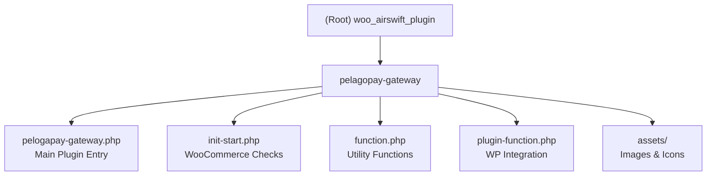

# Pelago Crypto Pay for WooCommerce

> AI Context Document - Auto-generated on 2026-01-20T17:58:16+0800

## Project Vision

A WordPress/WooCommerce payment gateway plugin that enables merchants to accept cryptocurrency payments through Pelago's secure digital QR code payment system. The plugin integrates seamlessly with WooCommerce checkout flow, supporting automatic currency conversion to USD and real-time payment status synchronization via IPN (Instant Payment Notification) callbacks.

## Architecture Overview

This is a **single-module WordPress plugin** following standard WooCommerce payment gateway patterns:

```
                    +------------------+
                    |   WordPress      |
                    |   WooCommerce    |
                    +--------+---------+
                             |
                    +--------v---------+
                    | WC_Pelago_Pay    |
                    | _Gateway Class   |
                    +--------+---------+
                             |
        +--------------------+--------------------+
        |                    |                    |
+-------v-------+   +--------v--------+   +------v------+
| Currency API  |   | Payment API     |   | IPN Callback|
| (weroam.xyz)  |   | (pelagotech)    |   | Handler     |
+---------------+   +-----------------+   +-------------+
```

### Core Flow

1. **Checkout**: Customer selects Pelago Crypto Pay at checkout
2. **Currency Conversion**: Plugin converts order amount to USD via internal API
3. **Order Creation**: Signed request sent to Pelago API to create crypto payment order
4. **Redirect**: Customer redirected to Pelago cashier page for QR code payment
5. **Callback**: Pelago sends IPN notification upon payment completion
6. **Order Update**: Plugin verifies signature and updates WooCommerce order status

## Module Structure



## Module Index

| Module | Path | Language | Description |
|--------|------|----------|-------------|
| pelagopay-gateway | `./pelagopay-gateway/` | PHP | WooCommerce payment gateway implementation |

## Development & Runtime

### System Requirements

- WordPress 5.0+
- WooCommerce 3.0+
- PHP 7.4+
- OpenSSL extension (for RSA signature)
- cURL extension (for HTTP requests)
- SSL certificate (recommended for production)

### Installation

1. Upload `pelagopay-gateway` folder to `/wp-content/plugins/`
2. Activate plugin in WordPress admin
3. Configure in WooCommerce > Settings > Payments > Pelago Crypto Pay

### Configuration Parameters

| Parameter | Description | Required |
|-----------|-------------|----------|
| `merchantId` | Pelago merchant identifier | Yes |
| `appKey` | Application API key | Yes |
| `merchantPrikey` | RSA private key for signing requests | Yes |
| `platformPublicKey` | Pelago public key for verifying callbacks | Yes |
| `testMode` | Enable staging environment | No |

### API Endpoints

| Environment | Currency API | Payment API |
|-------------|--------------|-------------|
| Production | `https://pgpay.weroam.xyz` | `https://api.pelagotech.com` |
| Staging | `https://pgpay-stage.weroam.xyz` | `https://stage-api.pelagotech.com` |

### Callback URL

The plugin auto-generates callback URL:
```
https://yourdomain.com/?wc-api=wc_pelagopay_gateway
```

## Testing Strategy

### Current Status

- **Unit Tests**: None
- **Integration Tests**: None
- **Manual Testing**: Via WordPress test environment with `testMode` enabled

### Recommended Testing Approach

1. Enable test mode in plugin settings
2. Use staging API endpoints
3. Test complete payment flow:
   - Order creation
   - Currency conversion
   - Payment redirect
   - IPN callback handling
   - Order status updates

## Coding Standards

### PHP Conventions

- Follow WordPress Coding Standards
- Use `function_exists()` checks to prevent redefinition
- Prefix all functions/classes with `pelago_`, `wc_pelago_`, or `WC_Pelago_`
- Text domain: `pelago-pay-woo`

### Security Practices

- RSA-SHA256 signature for all API requests
- Signature verification for all IPN callbacks
- Input sanitization via WordPress functions
- Direct file access prevention with `ABSPATH` check

### Comments

- Use English for code comments
- PHPDoc blocks for public methods
- Inline comments for complex logic

## AI Usage Guidelines

### When Modifying This Plugin

1. **Never expose sensitive keys** in logs or error messages
2. **Maintain signature verification** - do not bypass security checks
3. **Test in staging first** - always use `testMode` for development
4. **Preserve WordPress hooks** - maintain action/filter structure
5. **Handle errors gracefully** - use `wc_add_notice()` for user messages

### Key Files to Understand

1. `pelogapay-gateway.php` - Main gateway class, payment processing logic
2. `function.php` - Cryptographic functions, HTTP utilities
3. `init-start.php` - WooCommerce dependency checks

### Common Tasks

| Task | File | Function/Method |
|------|------|-----------------|
| Modify checkout display | `pelogapay-gateway.php` | `init_form_fields()` |
| Change payment flow | `pelogapay-gateway.php` | `process_payment()` |
| Update callback handling | `pelogapay-gateway.php` | `successful_request()` |
| Modify API requests | `function.php` | `wPost()`, `chttp()` |
| Change signature logic | `function.php` | `encodeSHA256withRSA()`, `verifySHA256withRSA()` |

## Changelog

| Date | Version | Changes |
|------|---------|---------|
| 2026-01-20 | - | Initial AI context document created |

---

## Related Files

- `ReadMe.md` - User documentation (English)
- `ReadMe-zh.md` - User documentation (Simplified Chinese)
- `ReadMe-zh-TW.md` - User documentation (Traditional Chinese)
- `ReadMe-ja.md` - User documentation (Japanese)
- `ReadMe-ko.md` - User documentation (Korean)
